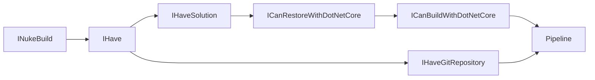

# C# Abstractions, the lies they tell us, and the fact you're likely still doing it wrong

Modern C# abstractions for real design problems

<div class="mt-6 text-sm opacity-80">

Use <kbd>→</kbd> / <kbd>←</kbd> to navigate slides

</div>

<!--
- Welcome the audience and introduce yourself.
- Hook: Most of us build abstractions by habit, often leading to over-engineered "dependency escape rooms".
- Goal: Learn how to use Modern C# features to build better, composable abstractions.
-->

---
layout: two-cols
---

# I'm Rodney


::right::

<div class="flex flex-col justify-center h-full ml-4">

- **Rodney Littles, II**
- Senior Software Engineer @ .NET
- Former Microsoft MVP & ReactiveUI Maintainer
- [Twitch.tv/rlittlesii](https://twitch.tv/rlittlesii)
- [@rlittlesii](https://twitter.com/rlittlesii)
- [GitHub/rlittlesii](https://github.com/rlittlesii)

</div>

---

# Agenda

- Abstractions
- Dependency Escape Room
- The Guidelines
- Modern C#
- The Build System

<!--
- High-level overview of what we will cover.
- Abstractions - What are they, why do you care
- Dependency Escape Room - all the lies we've been sold
- The Guidelines - Composition, SOLID & Coupling
- Modern C# - the applied patterns
- The Build System
- We'll move from the "Why" (Abstractions/SOLID) to the "How" (Modern C#/Composition).
- Final focus will be a practical Build System example.
-->
---
layout: center
class: text-center
---

# Disclaimer

> Don't go to work tomorrow and pitch re-architecting everything based on this talk

<!--
The plan is to show you techniques that if you want to start using, you can slowly integrate and strangle old approaches.
-->
---

# Why should we abstract?

#### Hint: The lies begin

- Testability
- Maintainability
- Clean Architecture
- The Seniors said so

<!--
How do we know why we do something if we don't know what it is?!
-->
---

# What are abstractions?

- __Fundamental Theorem of Software Engineering (FTSE)__
  - "We can solve any problem by introducing an extra level of indirection." — [David Wheeler](https://en.wikipedia.org/wiki/Fundamental_theorem_of_software_engineering)
  - _"...except for the problem of too many levels of indirection."_
- This is the **only** reason we should abstract.
- __The Balancing Act__:
  - __Abuse is costly__: Over-engineering leads to cognitive load and "dependency escape rooms".
  - __Non-adherence is costly__: Tightly coupled systems are rigid, fragile, and untestable.
  - Mastery is knowing when *not* to add the layer.

<!--
- Reference David Wheeler's quote on indirection.
- The "Core Why": Managing complexity and change.
- Discuss the trade-off: The cost of abuse vs. the cost of non-adherence.
- Next we'll talk about the tools of abstraction
-->
---

# Abstractions

- __Hide complexity__ behind a stable boundary.
- __Enable extensibility__ (composable elements, shared behavior).
- __Improve testability__ (mocking and isolation).
- __Decouple__ high-level policy from low-level implementation.

<!--
- Summarize the "What" of abstractions.
- Emphasize boundary management, extensibility, and testability.
-->
---

# C# Interfaces

- __What is an interface?__
  - A contract defining a set of signatures (methods, properties, events, indexers).
  - Represents a **"can-do"** relationship or a role.
- __Value__:
  - Enables total decoupling from implementation.
  - Can contain **Default Interface Methods (DIMs)** for evolution.
- __When to use__:
  - Capabilities shared across unrelated classes.
  - Supporting multiple inheritance of behavior.

<!--
- An Interface is a thin veneer 
- Define Interfaces as "contracts" for roles or capabilities.
- Mention that they enable total decoupling from implementation.
- Briefly touch on Default Interface Methods (DIMs).
-->
---

# C# Abstract Classes

- __What is an abstract class?__
  - A base class that cannot be instantiated.
  - Represents an **"is-a"** relationship (partial).
- __Value__:
  - Shared code, state (fields), and constructors.
  - Default behavior with enforcement of a contract.
- __When to use__:
  - Closely related types sharing state or internal logic.
  - Evolving a hierarchy without breaking derived types.
  - Forcing a specific lifecycle or structure.

<!--
- Define Abstract Classes as base types for closely related objects.
- Mention they represent "is-a" relationships and can hold state.
- Use them when you want to enforce a specific structure or shared logic.
-->
---

# The lies they told

- “Interfaces are class contracts”
- “Interfaces are for tests”
- “YAGNI doesn't apply to interfaces”
- “One implementation still equals polymorphism”
- “An interface should represent the whole object”

<!--
- Introduce the common myths we're about to debunk.
- These "lies" often lead to rigid and hard-to-maintain codebases.
-->
---
layout: two-cols-header
---

# Lie: The old-school class contract (C++ carryover)

::left::

<div class="p-4 border border-gray-500/10 rounded-lg h-full">

```csharp
// IUserService.cs
public interface IUserService
{
    User Get(Guid id);
    void Save(User user);
    void Delete(Guid id);
    void Notify(User user);
}
```

</div>

::right::

<div class="p-4 border border-gray-500/10 rounded-lg h-full">

```cpp
class UserService
{
public:
    virtual ~UserService() = default;

    virtual User Get(const Guid& id) const = 0;
    virtual void Save(const User& user) = 0;
    virtual void Delete(const Guid& id) = 0;
    virtual void Notify(const User& user) = 0;
};
```

</div>

<!--
- This came from pure virtual class thinking and got copy-pasted into C#.
- Reality: interfaces model **roles/capabilities**, not a full class surface.
- Smell to show: one `IUserService` contract that mirrors every public method.
- Final content will compare class-contract mindset vs composable role interfaces.
-->
---
zoom: 0.60
---

# Lie: YAGNI doesn't apply to interfaces

```csharp
public interface IEverythingService
{
    // User management
    User GetUser(Guid id);
    void CreateUser(User user);
    void DeleteUser(Guid id);

    // Authentication
    string Login(string username, string password);
    void Logout(Guid userId);

    // File system
    void SaveFile(string path, byte[] content);
    byte[] ReadFile(string path);

    // Logging
    void LogInfo(string message);
    void LogError(Exception ex);

    // Networking
    Task<string> CallApiAsync(string url);
    
    // Caching
    void SetCache(string key, object value);
    object GetCache(string key);

    // Configuration
    string GetSetting(string key);
    void SetSetting(string key, string value);

    // Payments (because why not)
    bool ProcessPayment(decimal amount);

    // UI (yep, we went there)
    void ShowDialog(string message);

    // Background jobs
    Task ScheduleJob(Func<Task> job);

    // Hardware interaction
    void Print(string document);
}
```
<!--
- "future-proof" contracts usually expose methods no caller needs *today*.
- This forces consumers to depend on unused members (ISP violation).
- Oversize contracts increase substitution risk (LSP pressure).
- Final content will show splitting by caller need instead of speculative growth.
-->
---

# Lie: One implementation still means polymorphism

```csharp
public interface IThing {}

public class Thing : IThing {}
```
<!--
- if there is only one concrete type and no variation point, the abstraction may be premature.
- Interface + single implementation can become ceremony without architectural lift.
- Keep seams where volatility is real; add more only when alternatives emerge.
- Final content will include a heuristic for when to keep concrete vs abstract.
-->
---
layout: two-cols-header
---

# Lie: Interface represents object, so include everything

::left::

<div class="p-4 border border-gray-500/10 rounded-lg h-full">

```csharp
public interface IUser
{
    Guid Id { get; set; }
    string Username { get; set; }
    string Email { get; set; }

    string? FirstName { get; set; }
    string? LastName { get; set; }

    DateTime CreatedAtUtc { get; set; }
    DateTime? LastLoginUtc { get; set; }

    bool IsActive { get; set; }
    string Role { get; set; }
}
```

</div>

::right::

<div class="p-4 border border-gray-500/10 rounded-lg h-full">

```csharp
public class UserDto : IUser
{
    public Guid Id { get; set; }
    public string Username { get; set; } = string.Empty;
    public string Email { get; set; } = string.Empty;

    public string? FirstName { get; set; }
    public string? LastName { get; set; }

    public DateTime CreatedAtUtc { get; set; }
    public DateTime? LastLoginUtc { get; set; }

    public bool IsActive { get; set; }
    public string Role { get; set; } = string.Empty;
}
```

</div>

<!--
- "object-shaped" interfaces often mix reads, writes, notifications, and orchestration.
- This breaks SRP and forces clients to depend on unrelated members (ISP).
- Better: slice by behavior (`ICanRead...`, `ICanWrite...`, `ICanNotify...`).
- Final content will map mixed contracts to role-based interfaces.
-->
---

# Domain Composition Approach

- Composition isn't just for build systems
- It's about "What I Have" vs "What I Can Do"

- I Have
- I Can

<!--
- Shifting the mindset from "What am I?" to "What do I have?" and "What can I do?".
- This is the foundation of domain composition.
-->
---

# Composition vs Inheritance

##### This is about relationships

- "Have A"
- "Am A"
- Both are ways to share behaviors

<!--
- Contrast "Have A" (Composition) and "Am A" (Inheritance).
- Both are legitimate ways to share behavior, but they have different trade-offs.
- In modern C#, we tend to favor composition for its flexibility.
-->
---

# SOLID for Composition (SRP, LSP, ISP)

<div class="grid grid-cols-3 gap-10 mt-10">
  <div>
    <h3 class="mb-4 text-primary">SRP</h3>
    <p class="font-bold">Single Interface, Singular Behavior.</p>
    <p class="text-sm opacity-80 mt-2">Keep interface surface area minimal and focused on one task.</p>
    <hr class="my-4 opacity-20" />
    <p class="text-xs italic opacity-60">"A class should have only one reason to change."</p>
  </div>
  <div>
    <h3 class="mb-4 text-primary">LSP</h3>
    <p class="font-bold">The Lift. Cleanly inject behavior.</p>
    <p class="text-sm opacity-80 mt-2">Inject into a subsystem without fear of leaking details.</p>
    <hr class="my-4 opacity-20" />
    <p class="text-xs italic opacity-60">"Subtypes must be substitutable for their base types."</p>
  </div>
  <div>
    <h3 class="mb-4 text-primary">ISP</h3>
    <p class="font-bold">The Secret Sauce. Segregate roles.</p>
    <p class="text-sm opacity-80 mt-2">Segregate into specific roles to fuel the lift from SOLID.</p>
    <hr class="my-4 opacity-20" />
    <p class="text-xs italic opacity-60">"Clients should not be forced to depend on unused methods."</p>
  </div>
</div>

<div class="mt-12 text-center">
  <p class="text-xl font-semibold">Together, these principles fuel <u>Domain Composition</u>.</p>
</div>

<!--
### SRP (Single Responsibility)
- Focus: Single Interface, Singular Behavior.
- Why keeping interfaces small and focused is crucial for later composition.
- Standard Definition: "A class should have only one reason to change, or in other words, it should have a single responsibility." — [Microsoft Learn]

### LSP (Liskov Substitution)
- The Lift: Cleanly inject any singular behavior (SRP).
- Ensuring that any implementation of an interface can be used wherever that interface is required.
- Standard Definition: "Subtypes must be substitutable for their base types without altering the correctness of the program." — [Wikipedia]

### ISP (Interface Segregation)
- The "Secret Sauce": This fuels the lift from SOLID.
- Smaller interfaces mean more granular and reusable components.
- Standard Definition: "Clients should not be forced to depend on methods it does not use." — [Microsoft Learn]
-->
---
layout: two-cols-header
---

# Traditional vs. Composition

::left::

__Traditional (Class Contract)__

<div class="p-4 border border-gray-500/10 rounded-lg h-full">

```csharp
public interface IUserService 
{
    User GetUser(Guid id);
    void Save(User user);
    void Delete(Guid id);
    void Notify(User user);
}
```

</div>

<p class="text-sm opacity-50">Representing the whole class contract as a single "double".</p>

::right::

__Composition Approach__

<div class="p-4 border border-gray-500/10 rounded-lg h-full">

```csharp
public interface ICanGetUsers { 
    User GetUser(Guid id); 
}

public interface ICanSaveUsers { 
    void Save(User user); 
}

// ... Role-based interfaces
```

</div>

<p class="text-sm opacity-50">Representing atomic behaviors and capabilities.</p>

<!--
- Direct comparison: One big interface (Traditional) vs. Many small interfaces (Composition).
- Traditional approach often leads to "God objects" and mocking pain.
- Composition approach allows for granular dependencies and easier testing.
-->
---

# Coupling & Cohesion

- __Goal__: Reducing **COUPLING** and increasing **COHESION**.
- __Coupling__: The degree of interdependence between software modules.
- __Cohesion__: The degree to which elements within a module belong together.
- __Relationship__: High cohesion often correlates with loose coupling, and vice versa.
- __Source__: [Wikipedia: Cohesion](https://en.wikipedia.org/wiki/Cohesion_(computer_science)) & [Wikipedia: Coupling](https://en.wikipedia.org/wiki/Coupling_(computer_science))

<!--
- Define Coupling (interdependence) and Cohesion (belonging together).
  - Should we organize by type (all the toothpaste goes together, all toothbrushes)
  - Should we organize by use (the toothpaste can be stored with the toothbrush)
- The "Myth": Loosely coupled, highly cohesive systems.
-->
---

# Representation in Modern C#

- Default Interface Methods (DIMs)
- Extension Methods
- Interface Overlap

<!--
- Overview of modern C# features that enable better abstractions.
- We'll look at how DIMs, Extension Methods, and Interface Overlap support composition.
-->
---

# Default Interface Methods (C# 8.0+)

- __What it is__: Members with default implementations in interfaces.
- __Value__: Evolve interfaces without breaking changes; mixin-like functionality.
- __Drawbacks__: Diamond problem (ambiguity); only accessible via interface reference.
- __What it is NOT__: Not a replacement for abstract classes; not extension methods.
- __When to use__: Evolving public APIs; optional convenience methods; mixins.

<!--
- DIMs allow adding members to interfaces with a default implementation.
- Great for evolving interfaces without breaking existing implementations.
- Be aware of the "diamond problem" and that they are only accessible via the interface reference.
-->
---

# DIM - The Fine Print

- __No Instance State__: Interfaces cannot have fields. They must rely on other properties or `TryGetValue`.
- __Diamond Problem__: Multiple inheritance can lead to ambiguity that must be resolved in the class.
- __Explicit Implementation__: Often needed to bridge between class state and interface behavior.
- __Discovery__: Implementation is "hidden" in the interface, not visible in the class file.

<!--
- Default Interface Methods (DIM) are the engine of this pattern.
- They allow shared behavior without inheritance, but they bring their own set of constraints.
- The "No State" constraint is the most significant; notice how Nuke uses properties and attributes to bridge this gap.
-->
---

# Extension Methods

- __What it is__: "Add" methods to existing types without modification.
- __Compositional Focus__: Extend types you don't own; keep core APIs small.
- __What it is NOT__: Not instance methods (no private access); not virtual (cannot override).
- __When to use__: Fluent APIs (LINQ); extending BCL/3rd-party types; ISP helper methods.

<!--
- Extension methods allow "adding" logic to types you don't control.
- Keeps core APIs small while providing convenience for consumers.
- They are static sugar, not true instance methods.
-->
---

# Interface Overlap & ISP

- __What it is__: Implementing multiple interfaces with shared member signatures.
- __ISP Focus__: Small, focused interfaces (roles). Overlap is a sign of role-based design.
- __Validity__: Perfectly valid in C#. Implicit or explicit implementation.
- __Explicit impl callout__: Keep role members off the concrete type surface and force role-based consumption.
- __What it is NOT__: Not multiple inheritance of state; not a conflict to be avoided.
- __When to use__: Satisfying multiple consumers; disambiguating members; keeping public APIs clean.

<!--
- Implementing multiple small interfaces is a sign of role-based design.
- Use explicit implementation to keep the concrete class surface clean.
- This forces consumers to use the object through a specific role/interface.
-->
---

# API Contract Versioning via Interface Segregation

```csharp
public interface IThingV1
{
    string Name { get; }
}

public interface IThingV2
{
    string Name { get; }
    string DisplayName { get; }
}

public class Thing : IThingV1, IThingV2
{
    public string Name { get; init; }
    public string DisplayName { get; init; }
}
```

<!--
- Use small versioned contracts to evolve APIs without forcing all clients to upgrade at once.
- Keep behavior additive and explicit: new consumers opt into `IThingV2`, older consumers stay on `IThingV1`.
- Avoid one giant interface that mutates over time and breaks compatibility.
-->
---

# QueryObject Pattern (aka "Repository, but honest")

- Use interface segregation for query/use-case specific roles instead of one giant repository contract.
- `SessionContext` composes query/write roles through explicit interface implementations.
- Consumers depend on the smallest contract they need: `IFindById`, `IFindByToken`, `IFindByEmail`, `ICreateSession`.
- This keeps the concrete type from becoming a God-object API surface.

---

```csharp
public class SessionContext : ICreateSession, IFindById, IFindByToken, IFindByEmail
{
    private readonly DbContext _db;

    public SessionContext(DbContext db)
    {
        _db = db;
    }

    Task ICreateSession.Create(OnboardingSession session) =>
     throw new NotImplementedException();

    Task<OnboardingSession?> IFindById.Find(SessionId sessionId, CancellationToken cancellationToken) =>
     throw new NotImplementedException();

    Task<OnboardingSession?> IFindByToken.Find(string token, SessionId sessionId, CancellationToken cancellationToken) =>
     throw new NotImplementedException();

    Task<OnboardingSession?> IFindByEmail.Find(string email, CancellationToken cancellationToken) =>
     throw new NotImplementedException();
}
```

<!--
- Example of a real-world pattern: QueryObject.
- The `SessionContext` handles multiple roles but exposes them individually.
- Notice the explicit interface implementation to keep the public surface of `SessionContext` minimal.
-->
---
layout: two-cols-header
---

# Benefits & Downfalls

::left::

__Traditional (Class Contract)__

- ✅ Simple discovery
- ✅ Low initial overhead
- ❌ Violates ISP
- ❌ Rigid coupling
- ❌ Mocking "God" objects

::right::

__Composition Approach__

- ✅ Focused roles
- ✅ Highly reusable "traits"
- ✅ Precise test isolation
- ❌ More files/types
- ❌ Higher discovery cost
- ❌ DIM limitations (No state)

<!--
- Honest look at the trade-offs.
- While composition has many benefits, it does increase the number of types and can make it harder to "see" the whole object at once.
- Tools like IDEs help mitigate the discovery cost.
-->
---

# The Build System Example

- A practical walkthrough of abstractions and shared behaviors

<!--
- Moving from theory to practice with a Build System example.
- This demonstrates how all the concepts we've discussed (ISP, LSP, Traits, DIMs) come together.
-->
---

# Why this pattern?

- __Granular Roles__: `IHaveSolution`, `IHaveGitVersion`, `IHaveArtifacts`.
- __Behaviors as Traits__: Logic stays in the interface (DIMs).
- __No Dependency Hell__: Objects only pull in what they need.
- __Testability__: Interfaces are naturally mockable.

<!--
- Final summary of the benefits of the composition pattern.
- Emphasize how it leads to a more flexible and testable architecture.
-->
---

# Third-Party API Seams (Nuke via ISP)

```csharp
public interface IHaveSolution : IHave
{
    [Solution]
    Solution Solution => TryGetValue(() => Solution)!;
}

public interface IHaveGitRepository : IHave
{
    GitRepository? GitRepository { get; }
}

internal partial class Pipeline : NukeBuild, IHaveSolution, IHaveGitRepository
{
    [Solution] private Solution Solution { get; } = null!;
    Nuke.Common.ProjectModel.Solution IHaveSolution.Solution => Solution;
    
    [OptionalGitRepository] public GitRepository? GitRepository { get; }
}
```

<!--
- Interfaces let us adapt third-party APIs without inheriting from abstract base wrappers.
- Apply ISP to expose only the role we need (`IHaveSolution`) instead of leaking the full `NukeBuild` object.
- Consumers stay build-agnostic; tests can use tiny fakes/stubs for that one role.
- Real-world example from: https://github.com/RocketSurgeonsGuild/Nuke
-->
---

# Stacked Like LEGO Blocks



<!--
- Compose build capabilities by stacking small `IHave...` + `ICan...` blocks.
- Each new block adds one concern without rewriting existing blocks.
- `Build` becomes an assembly of roles, not a giant inheritance hierarchy.
- The Mermaid diagram visualizes this "stacking" of roles and behaviors.
-->
---

# Composable Interfaces: Properties

- Define shared build properties using interfaces and attributes
- Use `IHave...` naming convention

```csharp
public interface IHaveSolution : IHave
{
    [Solution]
    Solution Solution => TryGetValue(() => Solution)!;
}

public interface IHaveGitRepository : IHave
{
    GitRepository? GitRepository { get; }
}
```

<!--
- Using interfaces to define shared properties.
- Attributes like `[Solution]` and `[GitRepository]` are used by the build engine to inject values.
- Notice the `IHave...` naming convention.
-->
---

# Composable Interfaces: Behaviors

- Define build targets as default interface implementations
- __The Requirement Pattern__: Behaviors inherit from the properties they need

```csharp
public interface ICanRestoreWithDotNetCore : IHaveSolution, ICan
{
    Target DotnetCoreRestore => _ => _
        .TryDependentFor<IHaveRestoreTarget>(a => a.Restore)
        .Executes(() =>
        {
            DotNetRestore(s => s
                .SetProjectFile(Solution));
        });
}
```

<!--
- Defining build targets (behaviors) as DIMs.
- `ICanRestoreWithDotNetCore` requires `IHaveSolution`.
- This enforces that any build that can "Restore" must also "Have a Solution".
-->
---

# Chaining Behaviors: Target Dependencies

- Interfaces can depend on other interfaces to enforce build order
- Use `.DependsOn()` to chain targets across interfaces

```csharp
public interface ICanBuildWithDotNetCore : 
    ICanRestoreWithDotNetCore, IHaveConfiguration, ICan
{
    Target DotnetCoreBuild => _ => _
        .DependsOn(DotnetCoreRestore)
        .Executes(() =>
        {
            DotNetBuild(s => s
                .SetProjectFile(Solution)
                .SetConfiguration(Configuration));
        });
}
```

<!--
- Chaining behaviors using `.DependsOn()`.
- The `Build` target depends on the `Restore` target.
- This creates an executable pipeline where order is guaranteed.
-->
---

# Cross-Cutting Concerns

- Shared properties and parameters that all interfaces can use
- `IHave...` interfaces for GitVersion, Artifacts, and CI

```csharp
public interface IHaveGitVersion : IHave
{
    GitVersion GitVersion { get; }
}

public interface IHaveConfiguration : IHave
{
    string Configuration { get; }
}
```

<!--
- Handling cross-cutting concerns like versioning and configuration.
- These are also just `IHave...` roles that can be mixed in wherever needed.
-->
---

# Explicit Overrides

- Use explicit interface implementation to customize inherited behaviors
- Maintain the original logic using `.Inherit<T>()` or replace it entirely

```csharp
internal partial class Pipeline : NukeBuild, ICanBuildWithDotNetCore
{
    // Override the target from the interface
    Target ICanBuildWithDotNetCore.DotnetCoreBuild => _ => _
        .Inherit<ICanBuildWithDotNetCore>(x => x.DotnetCoreBuild)
        .Executes(() =>
        {
            // Add custom logic after the inherited build
            Log.Information("Build completed successfully!");
        });
}
```

<!--
- When the default implementation isn't enough, we can override it.
- Explicit interface implementation allows us to customize the `Build` target for this specific build class.
- `.Inherit<T>()` lets us run the original logic and then add our own.
-->
---

# Comprehensive Composition

- Assemble a complete pipeline by mixing multiple properties and behaviors
- Shared state is managed via property interfaces

```csharp
internal partial class Pipeline : NukeBuild,
    ICanRestoreWithDotNetCore,
    ICanBuildWithDotNetCore,
    ICanTestWithDotNetCore,
    IHaveGitVersion,
    IHaveGitRepository
{
    public static int Main() => Execute<Pipeline>(x => x.Default);

    Target Default => _ => _
        .DependsOn<ICanTestWithDotNetCore>(x => x.DotnetCoreTest)
        .DependsOn<ICanBuildWithDotNetCore>(x => x.DotnetCoreBuild);
}
```

<!--
- The final assembly.
- The `Build` class composes all the desired traits and behaviors.
- The `Default` target defines the entry point of the pipeline.
- This is the power of composition in action.
-->
---
zoom: 0.70
---

# ICanDoStuff

```csharp
namespace Rocket.Surgery.Nuke;

// A tool to ensure the solution is updated with relevant files that exist on disk but not in projects.
[PublicAPI]
public interface ICanUpdateSolution : IHaveSolution
{
    // The solution updater that ensures that all the files are in the solution.
    Target GenerateSolutionItems =>
        d => d
            .Unlisted()
            // Does not work well on the linting runner
            // always seems to produce a commit against the solution
            .OnlyWhenStatic(() => IsLocalBuild)
            .TryTriggeredBy<ICanLint>(z => z.PostLint)
            .TryAfter<ICanLint>(z => z.PostLint)
            .Executes(
                 () =>
                 {
                     TargetAttributeCache.BuildCache();
                     var attributes = GetType()
                                     .GetCustomAttributes(true)
                                     .OfType<SolutionUpdaterConfigurationAttribute>()
                                     .ToArray();
                     SolutionUpdater.UpdateSolution(
                         Solution,
                         SolutionConfigFolderName,
                         attributes.SelectMany(z => z.AdditionalRelativeFolderFilePatterns),
                         attributes.SelectMany(z => z.AdditionalConfigFolderFilePatterns),
                         attributes.SelectMany(z => z.AdditionalIgnoreFolderFilePatterns)
                     );
                 }
             );

    // The name of the folder that contains the solution configuration files in the solution
    string SolutionConfigFolderName => "config";
}
```

<!--
The important note here.  Because interfaces have no instances state it's difficult to asign values.
-->
---

# Example: Composable Parameters

- Composing parameter discovery via traits

```csharp
public interface IHaveArtifacts : IHave
{
    [Parameter("The artifacts directory", Name = "Artifacts")]
    AbsolutePath ArtifactsDirectory => 
        EnvironmentInfo.GetVariable<AbsolutePath>("Artifacts")
        ?? TryGetValue(() => ArtifactsDirectory)
        ?? NukeBuild.RootDirectory / "artifacts";
}

public class Build : NukeBuild, IHaveArtifacts { }
```

<!--
- Practical example: Using interfaces to add "traits" to data objects.
- `IHaveArtifacts` provides logic to locate a directory that any implementer gets for free.
- This keeps the `Build` class clean and focused on targets.
- Real-world example from Rocket.Surgery.Nuke.
-->
---

# Example: Composable Behaviors

- Composing role-based behaviors

```csharp
public interface IHaveBuildVersion : IHaveGitVersion, IHaveSolution
{
    Target BuildVersion => d => d
        .Executes(() =>
        {
            Log.Information(
                "Building version {Version} of {Solution}",
                GitVersion.NuGetVersionV2,
                Solution.Name
            );
        });
}

public class Pipeline : NukeBuild, IHaveBuildVersion { /* ... */ }
```

<!--
- Another example of composition: `Pipeline` pulls in `IHaveBuildVersion`.
- It automatically gets the `BuildVersion` target and all necessary dependencies.
- No deep inheritance hierarchy required.
- Real-world example from Rocket.Surgery.Nuke.
-->

---

# Summary & Lessons Learned

<v-clicks>

- **Abstract with Purpose**: Only add indirection to manage complexity and change—avoid the "Dependency Escape Room."
- **Composition over Inheritance**: Build systems using small, composable traits (`IHave...`, `ICan...`) instead of deep hierarchies.
- **Interface Segregation**: Keep abstractions granular to ensure objects only pull in what they truly need.
- **Liskov Substitution**: Ensure that your implementations never break the contract defined by the abstraction.
- **Leverage Modern C#**: Use Default Interface Methods (DIMs) to encapsulate shared behavior directly within interfaces.

</v-clicks>

<!--
- Reiterate the core message: Abstractions should simplify, not complicate.
- Highlight the shift from traditional inheritance to modern, trait-based composition.
- These principles help build more maintainable and testable systems.
-->

---
layout: center
class: text-center
---

### Questions?

<div class="mt-12">

[github.com/rlittlesii/talks](https://github.com/rlittlesii/talks)

[@rlittlesii](https://twitter.com/rlittlesii)

[twitch.tv/rlittlesii](https://twitch.tv/rlittlesii)

</div>

<!--
- Wrap up the talk.
- Open the floor for questions.
- Provide links for further resources and contact.
-->
